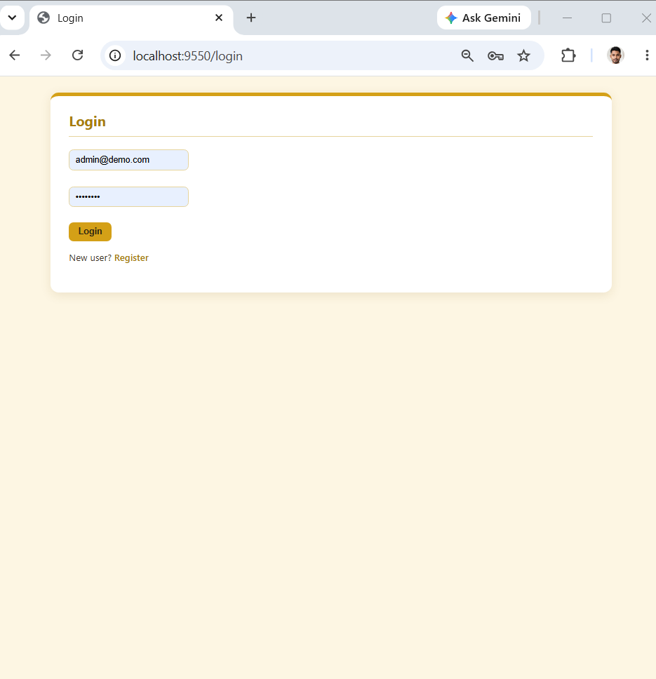
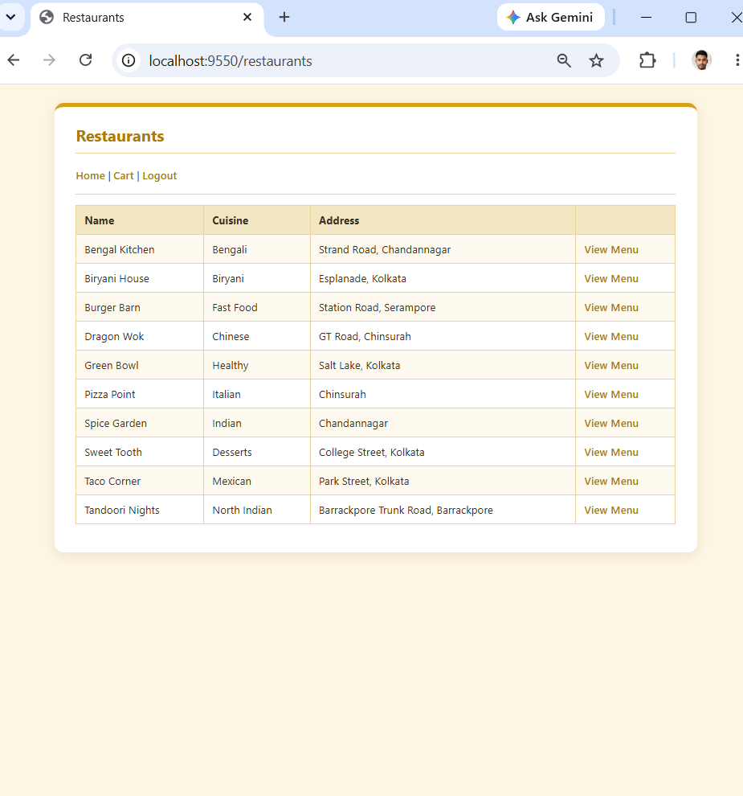
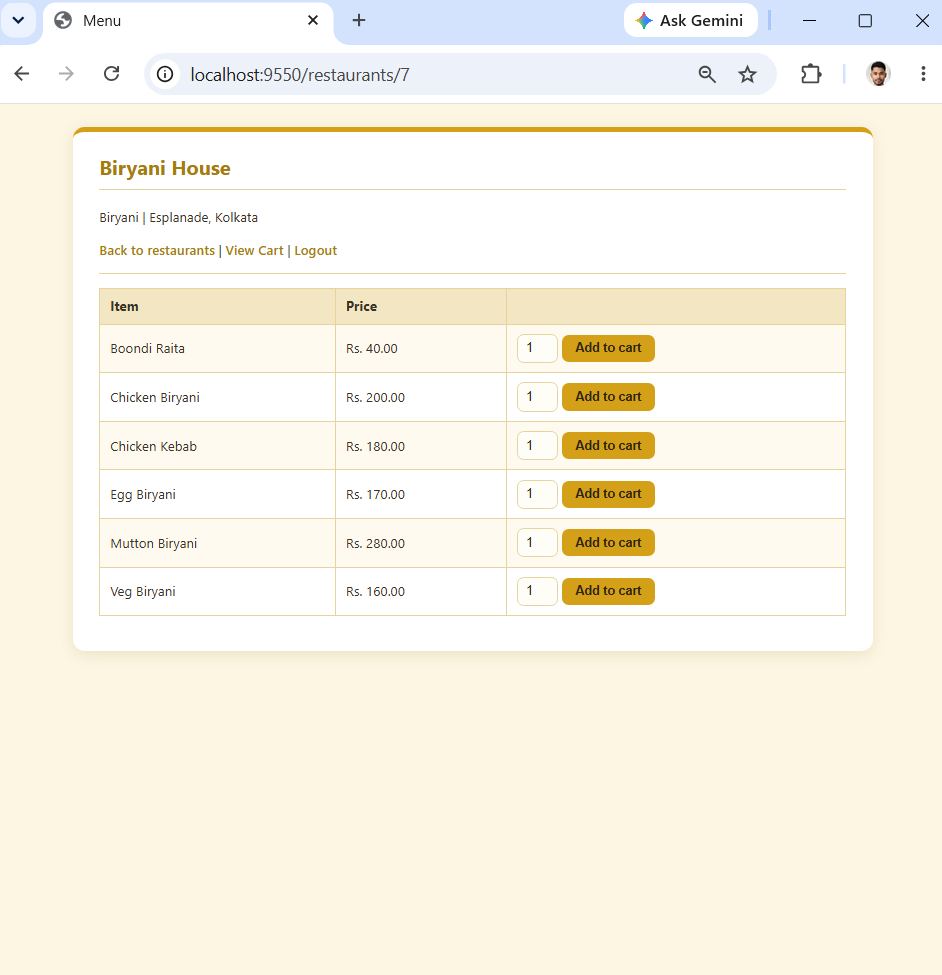
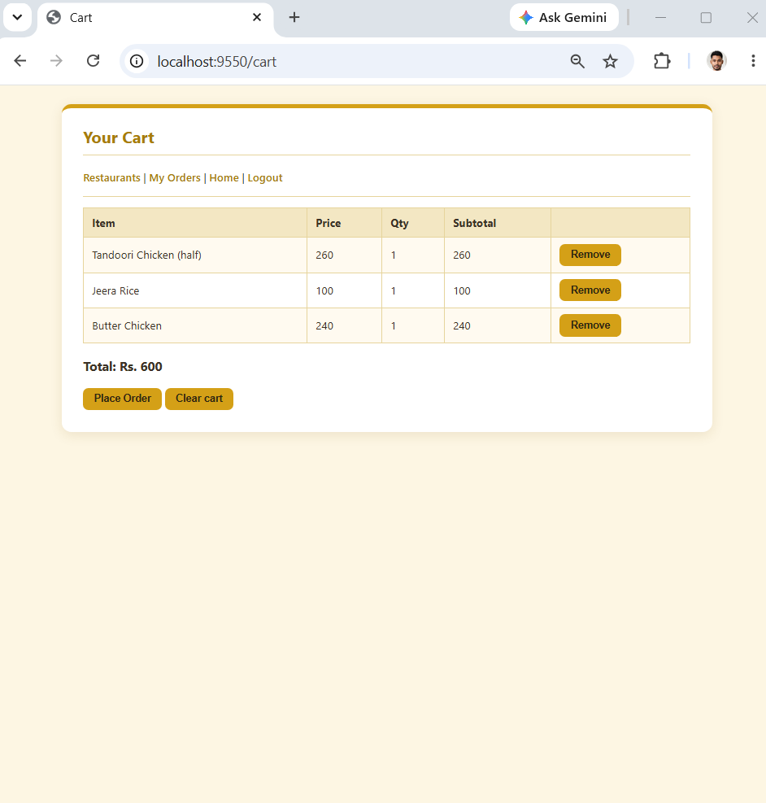
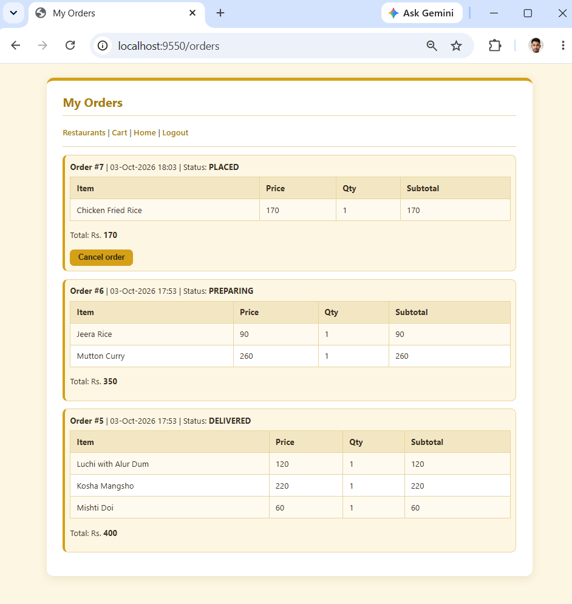
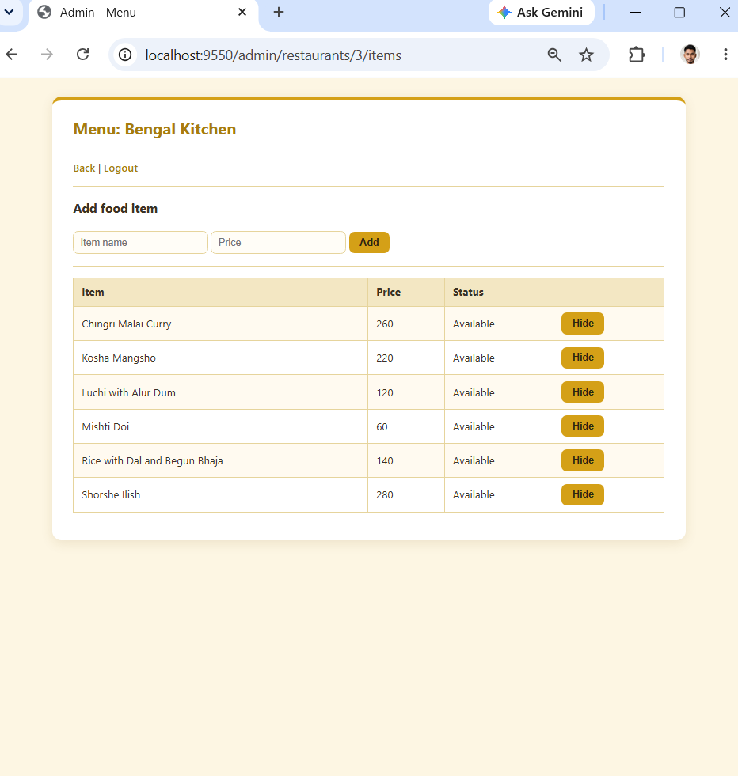
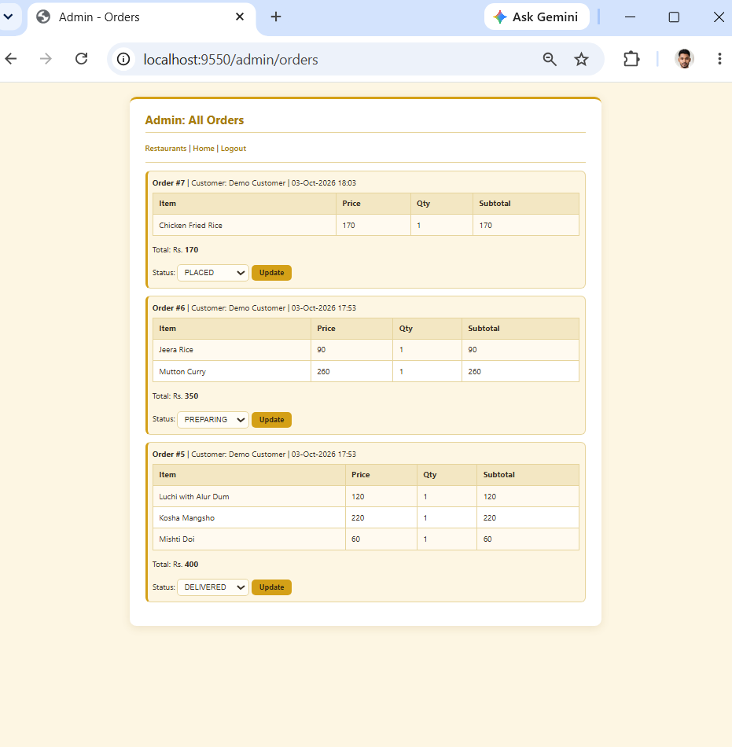

# Food Delivery App

A web application where customers browse restaurants, add dishes to a cart and place orders, and an admin manages restaurants, menus and order status. Built with Spring Boot, JDBC and Oracle.

## Features

**Customer**
- Register and log in (passwords hashed with BCrypt, session-based login)
- Browse restaurants and their menus
- Cart kept in the session (one restaurant at a time)
- Place an order: saved in one database transaction, with prices read again from the database
- Order history with status, and cancel an order while it is still `PLACED`

**Admin**
- Add, edit and delete restaurants and food items
- Hide or show menu items
- See all orders and update their status (`PLACED`, `PREPARING`, `DELIVERED`, `CANCELLED`)

**Other**
- Read-only REST API for restaurants and menus
- Server-side input validation and custom error pages

## Screenshots

### Customer side

| Login | Restaurants |
|---|---|
|  |  |

| Menu | Cart |
|---|---|
|  |  |

| My orders |
|---|
|  |

### Admin side

| Manage menu | All orders |
|---|---|
|  |  |

## Tech stack

| Part | Technology |
|---|---|
| Language | Java 17 |
| Framework | Spring Boot 4 (Spring MVC) |
| Database access | Spring JDBC (`JdbcTemplate`) |
| Database | Oracle (tested on 10g Express Edition) |
| Views | Thymeleaf, plain CSS |
| Password hashing | BCrypt (`spring-security-crypto`) |
| Build | Maven |

## Project structure

```
src/main/java/com/fooddelivery
├── controller   web and REST controllers
├── service      business logic (validation, order placing, cancel rules)
├── repository   JDBC queries
└── model        User, Restaurant, FoodItem, CartItem, Order, OrderItem
src/main/resources
├── templates    Thymeleaf pages
└── static/css   stylesheet
database
├── schema.sql        tables, sequences, triggers and a small sample
└── sample-data.sql   optional demo restaurants and menu items
```

## Getting started

**Requirements:** Java 17, Maven (or the included `mvnw`), and an Oracle database.

1. **Create a database user** (as an administrator, for example in SQL*Plus):
```sql
   CREATE USER fooddelivery IDENTIFIED BY your_password;
   GRANT CONNECT, RESOURCE TO fooddelivery;
   ALTER USER fooddelivery QUOTA UNLIMITED ON USERS;
```
2. **Create the tables:** connect as that user and run `database/schema.sql`.
   Optional: run `database/sample-data.sql` once for more demo restaurants and dishes.
3. **Add your database settings:** create `src/main/resources/local.properties` (it is ignored by Git):
```properties
   spring.datasource.url=jdbc:oracle:thin:@localhost:1521:xe
   spring.datasource.username=fooddelivery
   spring.datasource.password=your_password
```
4. **Run the app:**
```
   mvnw spring-boot:run
```
   Open `http://localhost:9550`.
5. **Create an admin:** register a user, then run:
```sql
   UPDATE users SET role = 'ADMIN' WHERE email = 'your_email';
   COMMIT;
```
   Log out and log in again.

## REST API

| Method | URL | Returns |
|---|---|---|
| GET | `/api/restaurants` | all restaurants |
| GET | `/api/restaurants/{id}` | one restaurant (404 if missing) |
| GET | `/api/restaurants/{id}/menu` | available items of a restaurant |

## Design notes

- Each order line stores the price at the time of ordering, so later price changes do not change old orders.
- The server reads food prices from the database when an order is placed, never from the form.
- Orders are loaded and cancelled using the logged-in user's id, so users cannot see or cancel each other's orders.
- Placing an order is one `@Transactional` method: the order and all its items are saved together or not at all.

## Limitations and next steps

- Uses simple session checks instead of Spring Security (no CSRF protection yet; logout is a GET link)
- Plain JDBC; a move to Spring Data JPA is planned
- No payments, delivery tracking or search

## Author

Subhadeep Das Goswami: [github.com/Subhadeep2k03](https://github.com/Subhadeep2k03)
